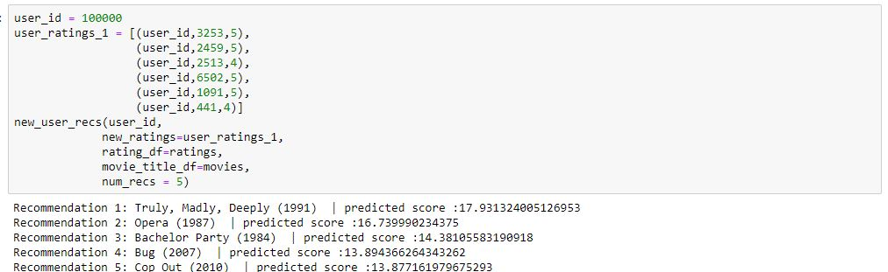
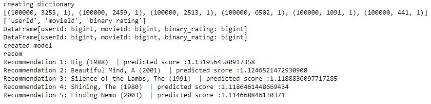

# Building a Recommender System
## Providing Recommendations based on Collaborative Filtering

## Goals and Overview

For those of us constantly accessing the web, we are all too familiar with Recommender Systems. They are all around us and are either those pesky ads that are listening in on our conversations or a holy grail for new information or purchases. Love them or hate them, these recommender systems are widespread for a reason. These systems have played an integral part in the success of many large online businesses such as Amazon, Google and Spotify and are providing some of these companies up to 30% of their total revenue. The goal of this project is to build a basic recommender model to get more familiar with aspects of Machine Learning. To test a recommender system, the popular online movie dataset from MovieLens will be employed to make movie recommendations to users based on how they rate certain movies. The users will rate these movies to "put them on the map" in terms of data, handling what is called the cold approach. The movies suggested to the users will be based on movies other users enjoyed and who rated the same movies similarly to the users being suggested to, also known as collaborative filtering. The model in this project was produced using Alternating Least Squares in PySpark.

# Importing and First Impressions

To start, the data was imported:

The small movie list was used from MovieLens. In this particular project, the ratings and movies .csv files were used.

# EDA

Before building the model, the data was explored to get a better understanding of the data being worked with.

## Question 1: What are the average User Ratings?

### Conclusion 1:

From the graph above, we see that most users tend to rate movies a 3 or above.

## Question 2: Which Genres tend to get highest ratings?

### Conclusion 2:

Genres were rated fairly similarly, having similar rating means. The genres that tended to receive higher ratings were Film-noir, War and Documentary movies. Horror movies seemed to get rated slightly lower on average.

## Question 3: Which Movies are the Highest Rated?

### Conclusion 3:

This question did not provide much insight as there were many movies that had perfect mean ratings of 5.

# Building the Model using ALS

The model was built using ALS and the parameters were tuned using CrossValidation.

# Modernizing the Model

To push the project further, I attempted to modernize the model by changing the ratings to a binary system to match the popular Thumbs Up or Thumbs Down that have taken over the entertainment recommender systems. Any rating given under a 3 was considered a 0, or Thumbs Down, while a 3 or above was a 1, or Thumbs Up. 

# Future Work

My personal goal for future work of this project is to trying to improve the recommender system by trying different parameters for tuning or different model types altogether. Another goal is to provide a interactible User Interface so that anyone can try and use the model.
